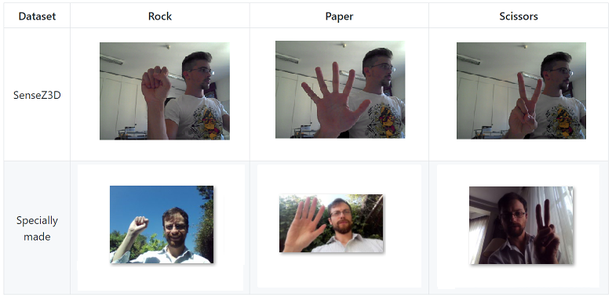

# Machine Learning Engineer Nanodegree
## Capstone Project
Juan Andrés Ramírez
October 29th, 2017

## I. Definition

### Project Overview

#### Hand Gesture Recognition

Hand gesture recognition is an important research issue because of its extensive applications in virtual reality, sign language recognition, and computer games [1]. Sensors used for hand gesture recognition include wearable sensors such a data gloves and external sensors such as video cameras and depth cameras [2]. Data gloves usually require extensive calibration and restrict natural hand movement [2]. Video-based based approaches addresses this issues but adds other problems, like the hand segmentation from background and occlusion [2]. There are several recent works that uses depth cameras as sensors, but this hardware doesn't have the availability that video cameras have today in people's homes.

Vision-based hand gesture recognition techniques can be divided into two groups: appearance-based approaches and 3D hand model-based approaches. Appearance-based approaches use image features of the hand and compare these parameters with the extracted image features from the input. 3D hand model-based approaches rely on a 3D kinematic hand model and try to estimate the hand parameters by comparison between the input images and possible 2D synthetic images, generated by the 3D hand model [3].

#### Convolutional Neural Networks (CNNs)

Several papers have shown that convolutional neural networks can deliver outstanding performance on challenging visual classification tasks [8]. CNNs are an attempt to solve the dilemma between small networks that cannot learn the training set, and large networks that seem over parametrized [8]. This is achieved by using convolutional layers that are applied as filters to the outputs of the previous layers. Each  convolutional unit serve as a feature detector and their parameters can be trained through *Backpropagation*. One of the best CNNs models available in literature is ResNet50, which architecture is detailed on **Algorithms and Techniques**

#### Transfer Learning

Transfer learning is a term that refers to the techniques that can be used to take advantage of the knowledge gained while solving one problem and applying it to a different but related problem [9]. In deep neural networks, this can be done by fixing specific weights of the network from a previously trained model and retraining the remaining ones using new samples related to the new problem.

In this project I created two appearance-based classifiers of the three rock-paper-scissors game hand gestures. One algorithm was trained by applying *Transfer learning* to a state-of-the-art object recognition CNN model. The other used a very simple CNN architecture fully constructed from scratch. The SenseZ3D static hand gesture dataset [4, 5] combined with a new set images (specially created for this project) were used for training and evaluation.

### Problem Statement

The main objective of this work is to create an image classifier capable of detecting the three different hand gestures from the rock-paper-scissors game. This classifier should allow a human user to play this game with a computer using just a screen and a webcam as an interface.

The first of the proposed solutions obtains a classifier by applying *Transfer Learning* to ResNet50 [7] convolutional neural network. A new rock-paper-scissors dataset (based on SenseZ3D [3, 4] and combined with new images) was created and used to adapt the weights of a fully connected layer that takes its inputs from ResNet50 pre-classification outputs. The second proposed solution was obtained by designing a very simple CNN architecture that was trained from scratch. This architecture takes the inputs from the same dataset, but uses the preprocessed images directly instead of using the ResNet50 features.

The resulting algorithms were evaluated as classification tasks where the input are the images of people showing hand gestures from rock-paper-scissors game. The accuracy measure it was used to evaluate performance over the three different classes of the rock-paper-scissors game.

### Metrics

The proposed evaluation metric is the classification accuracy over the test dataset. This measure is appropriate to the task because the classes have equal priority and the accuracy score shows overall classification performance. The accuracy score (A) is a function of the number of successfully classified samples (*k*) and the total number of samples in the dataset (*N*):

\begin{equation}
A = 100\frac{k}{N}
\end{equation}

## II. Analysis

### Data Exploration

Image hand gesture recognition is a very difficult task because the algorithms should deal with many problems:

* **Illumination variation:** Different illumination conditions generates different images
* **Point of view variation:** Different points of view for the same hand gesture generates different images
* **Posture variation** There are a large number of postures that the same hand can use to represent a single gesture.

The algorithm should work well on different conditions, so the training and testing datasets should reflect this noisy environments. For this purpose there's the need of using a lot of samples from different sources. The selected databases were:

* A subset of the **SenseZ3D** static hand gesture dataset [4, 5], which contains 30 images of different hand gestures from each of 4 subjects in webcam similar situations. The proposed subset contains just the gestures of Rock-Paper-Scissors (G1, G2 and G5)
* A **specially made** dataset with the webcam images. Originally this dataset had a very similar structure to the **SenseZ3D** (subject balanced) but it was necessary to made it simpler (see below on **Specially Made Dataset** details). The used database has some images from 13 subjects but mostly has images from me under different conditions.

The following table shows some samples from this datasets

Thus, considering both datasets, there were:

* 3 classes
* 1 main subject (17 total subjects)
* 1073 images per class
* 3219 total images

#### SenseZ3D Dataset

As mentioned before, the intended rock-paper-scissors classifier for the web should work well on a broad range of situations. However, the SenseZ3D dataset doesn't show too much variation in background, pose and illumination conditions of the images. The next figure shows this problem in the 30 images of subject 1 for gesture 1 (paper):

#### Specially Made Dataset

This dataset was created to provide the algorithm the possibility to learn from a wide range of conditions. Originally this dataset contained images with huge variations on the points of view, making it very hard to an algorithm to achieve good results because of the classes internal variance. To illustrate this, the following figure shows a hand making the same gesture but captured from 3 different points of view:

So, it was necessary to restrict the images and consider only pictures where the palm of the hand is heading the camera (as considered in the **SenseZ3D** dataset). This condition reduced the complexity of the problem but also decreased the number of available images, so it was needed to create more samples. Because of time considerations there were added mostly pictures of me. The effects of this decisions are discussed in the following sections.

### Exploratory Visualization

The main difficulties of this problem were already mentioned:

* Pose variation
* Illumination variation
* Background variation

This variations are shown in Figure 4 (refer to *Specially Made Dataset*).

As one of the proposed solutions uses ResNet50 features extracted from images, it would be interesting to look how this features will enable the classifier to discriminate between classes. This could be done by projecting sample's features into PCA axes and plotting the labeled points. This kind of analysis may help us to decrease the dimensionality of the problem as we could reduce the number of features. A first approach to this analysis is to evaluate how much variance is explained by the most important components of the PCA transformation from training data. Figure 5 shows just this for the most important components:

The first 100 components of the 2048 total number of features sums 83% of the total variance. This shows that there is a great chance we can reduce dimensionality in a significant way. However, this doesn't say anything about how this new subset of features may help us to discriminate between classes.

Figure 6 shows the classes distribution along the first 2 principal components (20% of variance explained). It is possible to see in this chart that classes are mixed in the projection. Clusters probably represents different environments where the pictures were taken. It would be very difficult for a classifier to perform well with this noisy features, given that the distributions of the classes are overlapped between them. This conclusion just applies to the 2 main components so it just suggest that the features that maximizes variance in data doesn't help to find the patterns that describes the classes. With this analysis alone we can't tell whether a wider dimensionality reduction based on PCA will work. It doesn't mean either that ResNet50 features are not useful.

In the training dataset the images have a lot of visual variations that aren't related with the classes. These include background variations, faces, face expressions, clothes, etc. In order to get a better projection it would be better to apply PCA analysis to a subset of images where the visual changes are strictly related with the classes. For example, using only pictures with hands over a white background.

The reduction of features will need testing and further study and are postponed for future work.

### Algorithms and Techniques

#### Classification Model

Deep convolutional neural networks have led to a series of breakthroughs for image classification [7]. Several results have been shown that this networks may outperform humans in object recognition tasks over images. This type of neural networks replace large layers of fully connected units by filtering layers that apply convolutions to their inputs. The use of several layers provides the network with great representation capacity.

##### ResNet50 Transfer Learning (M1)

The difficulty of designing a good model from scratch (computational complexity and the requirement of a huge amount of samples) justifies the utilization of *Transfer Learning* methods.

ResNet50, a convolutional deep neural network based on residual learning, is one of the better models available (considering performance on ImageNet) for the task of object recognition in images [7]. For this reason it was selected to be part of the proposed model. This model uses *residual layers*. This kind of layer differs from other architectures because provides input information to the output of the layer. The next figure shows the basic building block of ResNet50:

In ResNet50 this building block is serially repeated 50 times, however the authors suggests that performance can be subtly improved by making deeper architectures, making deepness restricted just by computational complexity limits/requirements and overfitting.

ResNet50 is much deeper than VGG architectures (VGG16 and VGG19) and the model size is actually substantially smaller due to the usage of global average pooling rather than fully-connected layers.

The intended classifier is a fully connected neural network layer which receives ResNet50 features from images. This feature extractors proved to be very useful and outperformed any other algorithm in the object classification task using just a single fully-connected layer at the end (a very simple classifier model). This was possible because of the stacked features extractors that can be found in the deepness of the architecture, which justifies the use of this features instead of other possible feature extractors like Gabor-Filters or Local Binary Patterns. However, this kind of features and others could be studied on future work.

The proposed algorithm receives a color image of size 224x224x3 which must be preprocessed with the methods proposed in [7] and then the features are extracted using ResNet50 model. As an output the classifier returns a vector where each of its three components is the predicted probability for each class. The features from ResNet50 are taken after reducing dimensionality with an average pooling layer, as suggested by the authors [7].

The average pooling layer takes the average result from certain dimensions of a vector. Dropout layers were also tested (dropout layers randomly inhibits signals on training and are commonly used to prevent overfitting) but wasn't considered in the final model.

The final total number of features is 2048. As the authors use a final fully-connected neural network layer, the same it is used in this project. This layer ends on a *softmax* activation step to get probability outputs. The classification layer has 6147 weights to provide an output of three components.

##### Model from scratch (M2)

Given that the previous approach didn't performed as needed (see *Results* section below), a new architecture was developed. The proposed architecture is very simple. The main focus of the design was to achieve good enough results with the minimum number of parameters. The proposed architecture receives a color image of size 224x224x3, preprocessed by the same methods mentioned in [7]. The network then process the input in several convolutional layers with *maxpooling* (this reduces the size by taking maximum value of the output in a matrix window) that reduces the number of elements on each layer. The architecture is described by:

* Layer 1: Convolutional Layer, Depth (number of filters): 16, Kernel Size (filters width): 2, MaxPooling Layer pool size: 2
* Layer 2: Convolutional Layer, Depth (number of filters): 16, Kernel Size (filters width): 2, MaxPooling Layer pool size: 2
* Layer 3: Convolutional Layer, Depth (number of filters): 32, Kernel Size (filters width): 2, MaxPooling Layer pool size: 2
* Layer 4: Convolutional Layer, Depth (number of filters): 32, Kernel Size (filters width): 2, MaxPooling Layer pool size: 2
* Layer 5: Convolutional Layer, Depth (number of filters): 32, Kernel Size (filters width): 2, MaxPooling Layer pool size: 4
* Layer 6: Flatten Layer (this transforms the input into a vector)
* Layer 7: Dropout Layer, with 0.2 of inhibition probability
* Layer 8: Dense Layer, Fully connected layer with *softmax* activation in order to get *probability* outputs

All convolutional layers have *relu* activation because it's often recommended to prevent *vanishing gradients*.

This model has a total of 12,451 trainable parameters.

More discussion about this architecture can be found on the following sections.

#### Training

Several algorithms and configurations were tested. The one that threw better results on both proposed models was RMSProp with [Keras default parameters](https://keras.io/optimizers/)

#### Data Augmentation

Data Augmentation is a common technique to better exploit the available dataset and also used by the authors of ResNet50. For the purposes of this project, a different configuration was applied:

* Rotation up to 40 degrees (to consider just standard hand positions)
* Shifting up to 10% (not too much shifting to prevent the hands to be cropped)
* Zoom range of 0.1 (not too much zoom variation to prevent the hands to be cropped)
* Horizontal flipping to prevent right-handed bias
* Filling by nearest method, to hide rotation information to the algorithm

The following figure shows the samples generated from a single image:

### Benchmark

A general hand gesture classifier model may be used as a benchmark for this project. This type of classifiers usually work with more than three classes, but they are the closest benchmarking models found in literature.

In the work done in [6], researchers used a very small training set (images from 3 out of 19 individuals) and a very large testing dataset. They claimed to have achieved 85.8% accuracy on images with complex background when classifying them into 12 different hand postures. This work seems to be a little bit old and it is not possible to get its source code. Also the dataset used in their study contains images of smaller size, which makes them not appropriate to use with the proposed model. However, as most of the recent work is based on range cameras, this research appears to be a good reference and starting point for this project.

## III. Methodology

### Data Preprocessing

#### Operation

When in operation, to classify images, the proposed methods need all images to be pre-processed by the Operation Pre-Process scheme, defined by the steps below:

1. Rescale to 224x224
2. Execute the preprocessing method defined in [7] and [available in Keras](https://keras.io/applications)
3. Get features from ResNet50 (only M1): Execute ResNet50 algorithm and extract the outputs of the layer that precedes the classification layer

#### Training/Testing

For training and testing, the following pre-processing steps were applied to Training and Evaluation datasets (Testing dataset images are rescaled but not augmented):

##### ResNet50 Transfer Learning (M1)

1. Make augmentation. The datasets were augmented off-line by a factor of k (different values of k were used). This means that for each image, k new images were generated applying random transformations. The transformations parameters were described in *Data Augmentation*. The resulting images were scaled to 224x224
2. Apply the Operation Pre-Process to all images

##### Model from scratch (M2)

1. Apply the Operation Pre-Process to all images
2. Apply online augmentation (for each training epoch a modificated version of the dataset is used to adjust the weights. This modificated dataset is created randomly using the augmentation parameters described on previous sections)

### Implementation

The final implementation was made on Keras, using TensorFlow backend.

The Keras implementation of ResNet50 was used to extract the features from the images. The code with the bests results can be found at the [**project's M1 notebook**](https://github.com/juanneilson/machine-learning/blob/master/projects/capstone/Cachipun_transfer_learning.ipynb) and at the [**project's M2 notebook**](https://github.com/juanneilson/machine-learning/blob/master/projects/capstone/Cachipun.ipynb)

#### Data Partition

Before pre-process, data was divided into training, validation and testing subsets. At first, the validation subset was made with all the images taken from two of the subjects from the *Specially Made* dataset and the testing subset was created also from all the images but from another two subjects of the same dataset. This partition enabled us to measure how the classifiers generalized with new subjects, but the results were poor because of the high variation of points of view. Thus, when constraining the set of images to a single point of view (with palms facing the camera) there weren't enough images to make the same tests. So, with the restricted dataset, all the remaining images from validation and testing subsets were used and to each of this partitions a new set of pictures of me (a subject that is also present in training partition) was added. Thus each of this partitions has some images from *new* subjects (not present in training), but also a large set of new images of me with *new* environments. The partition distributions were:

* Training samples: 2739 (85%)
* Validation samples: 240 (7%)
* Testing samples: 240 (7%)

##### M1 Transfer Learning augmentation

 With the model M1 an off-line augmentation scheme with a factor of 5 (meaning that 5 augmented images were generated from each dataset sample) was applied. Augmentation increased the number of samples to 13695 in the training set and 1200 in validation subset. With this configuration the number of testing and validation images is below the usual standards. It was made this way because of the of lack time to collect data for training. The usual costs of using small testing/validation subsets are the uncertainty of the generalization measure (we can't be so certain about our measured generalization power) and the high deviation of results from the same model architecture (same training experiments with different initializations may deliver different results).

 A greater augmentation factor was also tested but this didn't improved the results. This is probably because ResNet50 features are invariant in some degree to most of the changes that the augmentation scheme makes to the samples.

#### Training

The models were feed with the preprocessed images as described on previous sections.

RMSProp was used to train the proposed models.The best results were obtained with the default parameters (lr=0.001, rho=0.9, epsilon=1e-08, decay=0.0). However, it was difficult to test different parameters because of the high variation of results (small test subset as explained before).

##### Training of M1

Training was made considering a batch size of 400 and 200 epochs. The training curves are shown in the following figures:

From this curves it is possible to observe that it starts overfitting near epoch 50.

##### Training of M2

Training was made considering a batch size of 30 and 150 epochs. The training curves are shown in the following figures:

#### Testing

The resulting model was evaluated using the preprocessed test dataset. The accuracy score was calculated and also a confusion matrix was generated to compare individual class performances.

### Refinement

As stated before, it was difficult to refine parameters because of the lack of data and the consequent variance of the accuracy for different initializations (~5%).

Several combinations of number of epochs and batch size were studied without significant conclusions.

#### M1 Refinement

Two values of the dataset augmentation factor k were tested using the optimal model. The value of 10 revealed to be not better than k factor value of 5. As there weren't too much samples for this project, data augmentation sounded like a very good option to improve results. However, adding more than 5 augmentation images wasn't making the results any better. This can be explained by the deepness of the ResNet50. This model was trained on a huge augmented dataset and as it is shown on the literature, most of the last layers of a deep neural network works over high-level object representations. Thus it is probable that most of the features we are using to feed the proposed model are already robust to rotation and scaling transformations. The final code uses k = 5 as it proved to work well and it is also more efficient than any bigger value.

## IV. Results

### Model Evaluation and Validation

#### M1 Evaluation

The resulting model achieved a mean accuracy of 68% over the test dataset (standard deviation of 6.24).

The model's accuracy was measured on several experiments, using the same conditions but different initial weights and data sorting. Results are resumed in the following table:

|Test ID| Accuracy Score[%]|
|-------|------------------|
|1|65.0|
|2|62.9|
|3|74.6|
|4|76.3|
|5|64.6|

This results show that it is possible to obtain a model that generalizes well, but this results aren't good enough considering that testing dataset its mainly made out of images from a subject that is present on the training set.

As announced before, there is also high variance in the result just by changing initialization weights and the order of the samples input. This is another reason to believe in adding more data to the test subset to help us to be more confident about generalization.

The model from test number 1 was used to generate the following non-normalized confusion matrix:

The confusion matrix shows that the proposed classifier performs better on Rock and Paper images than Scissors. The images of this last category are often misclassified.

The results are good, far better than a random classifier. However there's still work to do in order to be able to perform on a website.

#### M2 Evaluation

The resulting model achieved a mean accuracy of 90.3% over the test dataset (standard deviation of 1.23).

The model's accuracy was measured on several experiments, using the same conditions but different initial weights and data sorting. Results are resumed in the following table:

|Test ID| Accuracy Score[%]|
|-------|------------------|
|1|90.0|
|2|91.3|
|3|88.3|
|4|90.8|
|5|91.3|

This results show that it is possible to obtain a model that generalizes well and significantly better than model M1.

One of the models (5) was used to generate the following non-normalized confusion matrix:

### Justification

The benchmarking model reported 85.8[%] accuracy score in the static hand gesture classification task and one of the proposed models (M2) achieved over 90[%] of accuracy. This results can't be compared directly, because the datasets aren't the same. Besides the images, one of the main differences between the datasets is that the benchmarking test considered generalization over new subjects, but M2 was evaluated on new images from a subject that was already on the training set. A new dataset must be created in order to evaluate how the proposed algorithm generalizes over subjects.

The M2 model performed much better than the M1 model. This can be counterintuitive considering that the ResNet50 is a highly engineered model and M1 is a very simple CNN. A good explanation for this performance differences is that ResNet50 was trained for a very different task. Features that helps to classify cats/dogs/cars aren't probably the better to discriminate between different hand poses. This idea is supported by the PCA chart made from ResNet50 features where the principal components were very noisy considering category classification.

More data from different subjects must be collected to evaluate how M2 could perform in a production environment. However, a 90[%] of accuracy score over the proposed test dataset could allow us to use the model in a beta application.

As the dataset images were restricted to have a specific point of view of the hand (palm facing the camera) the same condition must be applied when using the obtained models. Thus, users of an eventual application must be advised about how they have to put their hands in front of the camera.

## V. Conclusion

### Free-Form Visualization

Some results over random images from the testing subjects are displayed on Figure 13. This figure shows the proposed classifier M2 in action.

### Reflection

Two automatic classifiers of rock-paper-scissor hand gesture images were created. The goal was to create an algorithm able to perform in a game that allowed the user to play rock-paper-scissors with just the screen and a webcam as interface.

A new dataset was created to train/validate/test the model. After some attempts, it was necessary to restrict the samples to images where the palm of the hand is facing the camera.

One of the proposed methods (M1) adapts the ResNet50 architecture with *Transfer Learning*. This algorithm receives color images of any size, and after preprocessing the input (resizing, rescaling), it takes features from images using the ResNet50 network implementation from Keras. This features are used to feed a fully connected neural network layer which classifies the input into three different categories: Rock, Paper, Scissors. This fully connected layer was trained using RMSProp algorithm.

The second proposed method (M2) outperformed the first one. This second model is a simple CNN architecture that was created and trained from scratch. This algorithm receives color images of any size and after a preprocessing step (resizing and rescaling) the resulting image is used as an input to a CNN neural network that was trained using RMSProp. This network, just like the first one, returns an output that classifies the input into the three different categories of the game.

Accuracy scores were calculated from several training experiments and the confusion matrix of the selected models were generated. Results are very promising because the second method achieved over 90[%] accuracy on the testing set.

The proposed methods need to be evaluated on new subjects to be able to predict the performance on production environment.

It is very interesting to note that to create this classifier it wasn't needed any special knowledge, like digital image processing or hand anatomy studies. Just the correct images were fed to a general purpose model and good results were obtained.

It was also very interesting to note that when developing M1, from certain point, adding data augmentation wasn't helping anymore. This could be due to the transformation invariance of ResNet50 features.

### Improvement

Most of the proposed improvements in this section were thought considering M2, because M1 is probably harder to improve. One way to improve the results of M1 is to use the weights of ResNet50 as a starting point for a whole model optimization. However this method could require a huge amount of samples and computational resources. An alternative approach could be to do the training of just the last layers of the network, but this could be also time consuming, considering that there is already trained the M2 model with very good results with little number of layers.

The need of more samples has been extensively remarked along this report.

The main proposed improvements for M2 are:

* **Subject generalization evaluation**: The addition of images from new subjects into the dataset would allow us to evaluate the performance of the proposed method on conditions that are totally independent from the training environment
* **Fine tuning**: With more samples and a more significant test dataset, the fine tunning of M2 could improve results. It would be important to test different values for the learning rate.
* **Segmentation**: It would be possible to change the actual scheme adding a processing block capable of detect hands in the whole image before the classification step. This could be done by using *skin detectors* provided by some libraries or training a new model with this purpose in mind. The output of this module could be used as an input of a classification model similar to M2. This scheme could facilitate the classification process, cleaning it from background information.
* **More points of view**: In order to make users feel comfortable, new points of view could be added to the dataset. This would require to also add *representation power* to the model, by adding layers or by increasing the number of filters on each convolutional layer.

-----------

## References
* [1] Ren, Zhou, et al. "Robust hand gesture recognition with kinect sensor." Proceedings of the 19th ACM international conference on Multimedia. ACM, 2011.
* [2] Suarez, Jesus, and Robin R. Murphy. "Hand gesture recognition with depth images: A review." Ro-man, 2012 IEEE. IEEE, 2012.
* [3] Chen, Qing, Nicolas D. Georganas, and Emil M. Petriu. "Real-time vision-based hand gesture recognition using haar-like features." Instrumentation and Measurement Technology Conference Proceedings, 2007. IMTC 2007. IEEE. IEEE, 2007.
* [4] Minto, L., and P. Zanuttigh. "Exploiting silhouette descriptors and synthetic data for hand gesture recognition." (2015).
* [5] Memo, Alvise, and Pietro Zanuttigh. "Head-mounted gesture controlled interface for human-computer interaction." Multimedia Tools and Applications (2016): 1-27.
* [6] Triesch, Jochen, and Christoph Von Der Malsburg. "A system for person-independent hand posture recognition against complex backgrounds." IEEE Transactions on Pattern Analysis and Machine Intelligence 23.12 (2001): 1449-1453.
* [7] He, Kaiming, et al. "Deep residual learning for image recognition." Proceedings of the IEEE conference on computer vision and pattern recognition. 2016.
* [8] Zeiler, Matthew D., and Rob Fergus. "Visualizing and understanding convolutional networks." European conference on computer vision. Springer, Cham, 2014.
* [9] West, Jeremy; Ventura, Dan; Warnick, Sean (2007). "Spring Research Presentation: A Theoretical Foundation for Inductive Transfer". Brigham Young University, College of Physical and Mathematical Sciences. Archived from the original on 2007-08-01. Retrieved 2007-08-05.
